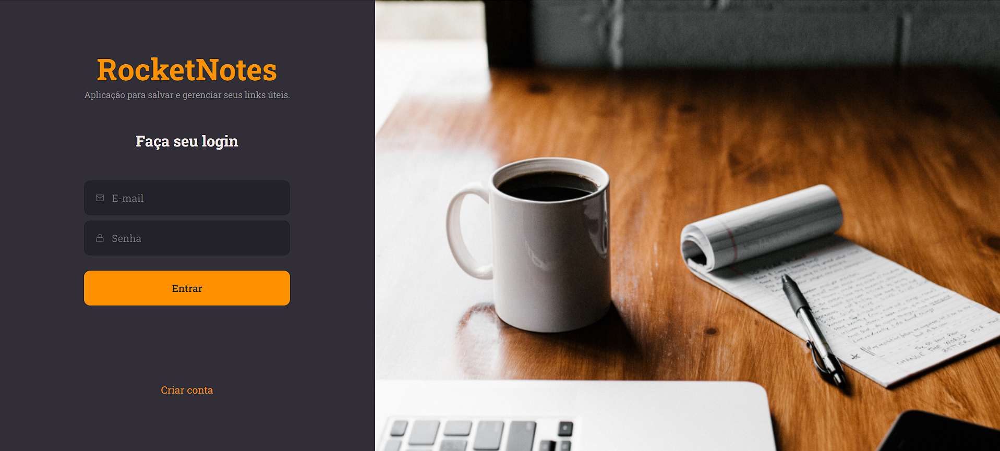
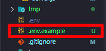

# Rocket Notes project - Back-end 📓⚙

## Under development ⏳

The project consists of an application where the user can create notes and save them in his account, allowing searches by title. I worked with CRUD, authentication token and password encryption.

## 🔧 Tecnologies

  JavaScript 
  Node.js
  SQLite
  Git
  Beekeeper
  Knex.js

## 🛅 Dependencies
 

enter your environments settings in ".env.example" for run this api in your machine.

## 🎨 Front-end

[🔗 Front-end - repository](https://github.com/tkoch97/rocket-notes-front)

## 📃 Docs

[🔗 Notations link - Node.js](https://rectangular-lemonade-0d3.notion.site/Node-js-584393270a1345b8944100fcf72ad363)

[🔗 Notations link - SQL](https://rectangular-lemonade-0d3.notion.site/Banco-de-dados-estruturados-SQL-dbe9feb94b1c48138e8fd9de470e0f91)

### Rocketseat explorer trail, stage 8 🚀
